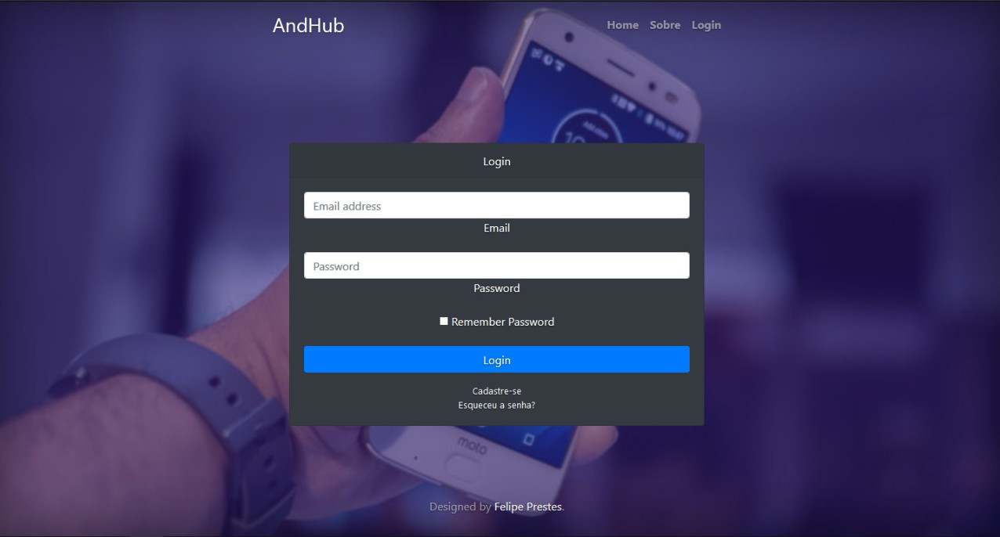
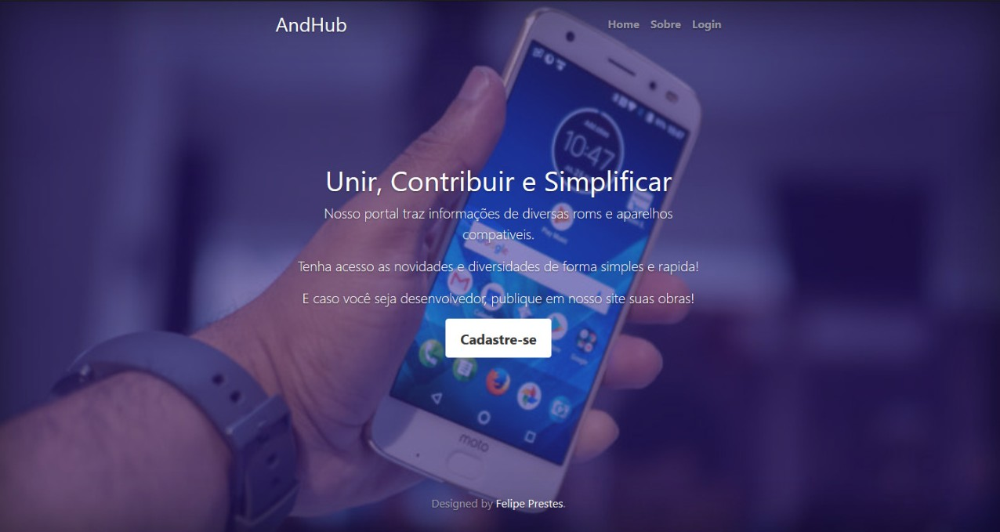
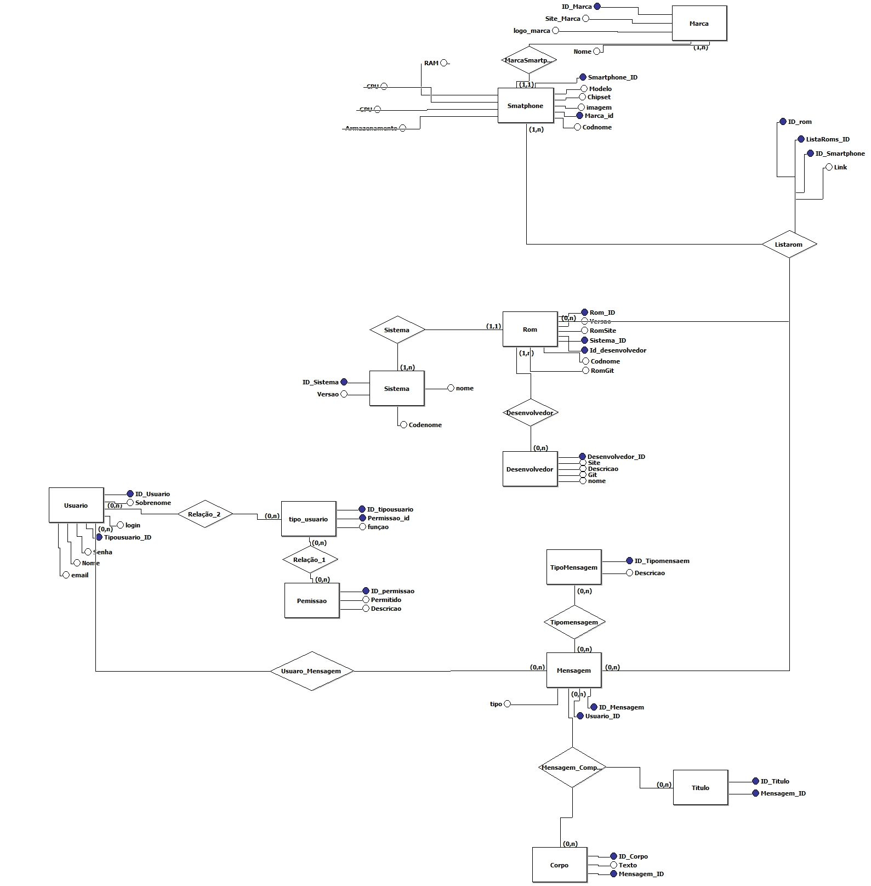

# AndHub

---

## Sobre o Projeto

O **AndHub** foi um projeto desenvolvido durante o curso de Tecnologia em Sistemas para Internet (TSI) como parte de uma disciplina, mas também representava uma ideia pessoal para criar uma plataforma online que unisse desenvolvedores de ROMs customizadas Android e usuários comuns.

A proposta do AndHub era facilitar a comunicação entre usuários e desenvolvedores, assim como simplificar a catalogação e o acesso a arquivos de ROMs e procedimentos técnicos. A intenção era criar algo mais prático, organizado e colaborativo que fóruns tradicionais como o XDA Developers.

O projeto se inspira em plataformas como [xdaforums](https://xdaforums.com/) e [CustomROMs](https://customroms.net/roms/), mas com uma proposta mais elaborada para engajamento e colaboração na comunidade Android customizada.

---

## Funcionalidades Principais

- Cadastro e login de usuários
- Espaço para desenvolvedores publicarem suas ROMs e trabalhos
- Interface simples e direta para acesso rápido a informações
- Organização de conteúdo focada em facilitar a navegação e busca
- Comunidade para troca de informações entre usuários e desenvolvedores

---

## Tecnologias Utilizadas

- HTML5, CSS3
- JavaScript
